# ManagedCode.SkillOpt architecture

The .NET package implements the reusable text-space optimization path from the upstream ReflACT trainer. A host supplies target tasks, one fixed target model client, a distinct optimizer model client, an `IEvaluator`, and explicit train/selection/test splits.

```mermaid
flowchart LR
  Cases[Training cases] --> Target[IChatClient: fixed target]
  Skill[Current skill Markdown] --> Target
  Target --> Score[IEvaluator + named numeric metric]
  Score --> Outcome[Failure and success trajectories]
  Outcome --> Reflect[IChatClient: optimizer reflection]
  Reflect --> Merge[Hierarchical patch aggregation]
  Merge --> Select[Rank and clip by edit budget]
  Select --> Apply[Exact-anchor patch or rewrite]
  Apply --> Candidate[Candidate skill]
  Candidate --> Gate[Selection split metrics plus application hard gate]
  Gate -->|accepted| Current[Current and best skill]
  Gate -->|rejected| Memory[Bounded rejected-edit memory]
  Current --> Epoch[Epoch meta memory and slow update]
  Epoch --> Current
  Current --> Test[Test split reporting only]
```

`SkillOptOptimizer` owns this orchestration in one process. `IChatClient` and `IEvaluator` are the only AI boundaries. Prompts are embedded from reviewed Markdown resource files. The caller owns client lifetimes, prompt/evaluator configuration, task data, checkpoint persistence, and artifact delivery. The package does not create network transports or applications.

A checkpoint callback is asynchronous and awaited before each target, optimizer, and evaluator call, so a host can durably persist reserved usage before the external effect. A failed or canceled in-flight operation leaves an unsafe checkpoint that cannot be resumed because its remote outcome may be uncertain. Safe checkpoints are emitted after completed step/epoch boundaries. Their fingerprint covers initial skill, options, run identity, split boundaries, case identifiers, and caller-supplied full-context case fingerprints. The host's `RunIdentity` must include model/evaluator/hard-gate policy identity. The caller is responsible for durable checkpoint storage. Checkpoints retain optimizer progress and scalar step history, not per-case metric reports; typed metric evidence (including the nullable official interpretation-failed flag) stays on the selection and split reports.

`ScoreDirection` makes minimization explicit (for example, a privacy-event count); scores are normalized to a higher-is-better objective for candidate ranking. Final split reports preserve every official evaluator metric as typed per-case evidence. An optional synchronous `CandidateGate` receives the candidate and its full selection report before the optimizer can accept it, allowing product code to enforce privacy or other hard constraints even when mean quality improves.

An optional `TargetMessageFactory` receives each untouched case message list and the current candidate skill as separate arguments for every rollout. The caller returns the exact target conversation, which allows candidate skill text to remain a distinct System message without merging or rewriting frozen scenario context. The default composer remains unchanged when the callback is omitted. Its stable behavior/version must be represented in `RunIdentity`.

See [Parity](Parity.md) for supported semantics and known deviations from the Python research framework.
